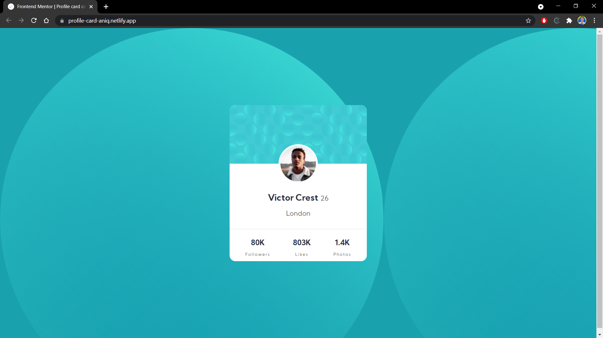

# Frontend Mentor - Profile card component solution

This is a solution to the [Profile card component challenge on Frontend Mentor](https://www.frontendmentor.io/challenges/profile-card-component-cfArpWshJ). Frontend Mentor challenges help you improve your coding skills by building realistic projects. 

## Table of contents

- [Overview](#overview)
  - [The challenge](#the-challenge)
  - [Screenshot](#screenshot)
  - [Links](#links)
- [My process](#my-process)
  - [Built with](#built-with)
  - [What I learned](#what-i-learned)
  - [Continued development](#continued-development)
  - [Useful resources](#useful-resources)
- [Author](#author)
- [Acknowledgments](#acknowledgments)

## Overview

### The challenge

- Build out the project to the designs provided

### Screenshot

The picture shows the profile card in desktop mode

### Links

- Solution URL: [html](https://github.com/niqaqil/profile-card-component/blob/main/index.html), [css](https://github.com/niqaqil/profile-card-component/blob/main/style.css)
- Live Site URL: [live preview](https://profile-card-aniq.netlify.app/)

## My process

### Built with

- Semantic HTML5 markup
- CSS custom properties
- Flexbox
- CSS Grid
- Mobile-first workflow
- [Styled Components](https://styled-components.com/) - For styles

### Continued development

Use this section to outline areas that you want to continue focusing on in future projects. These could be concepts you're still not completely comfortable with or techniques you found useful that you want to refine and perfect.

### Useful resources

- [FreeCodeCamp](https://www.freecodecamp.org/learn/responsive-web-design/) - This is a good resource to learn basic html and css with some intersting projects
- [HTML and CSS code guide](https://github.com/mdo/code-guide) - This one help me to code better in html and css

## Author

- Website - [Aniq Aqil](https://www.your-site.com)
- Frontend Mentor - [@niqaqil](https://www.frontendmentor.io/profile/niqaqil)

## Acknowledgments

This is where you can give a hat tip to anyone who helped you out on this project. Perhaps you worked in a team or got some inspiration from someone else's solution. This is the perfect place to give them some credit.
